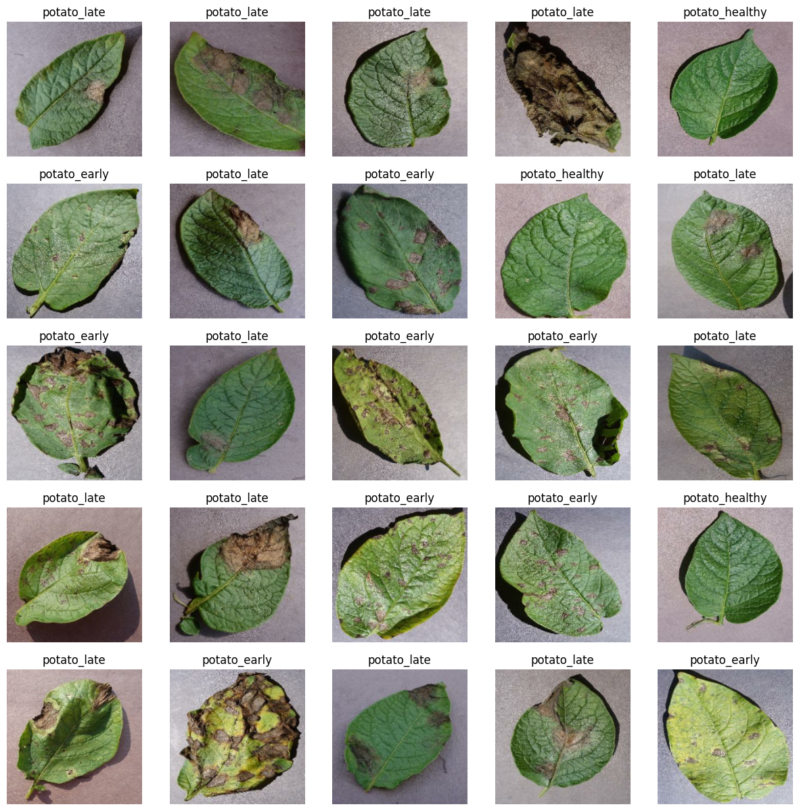

## 🌿 Overview

---

This design doc outlines the development of a web application for Leaf Disease Prediction using a using Tensorflow. The application will utilize Deep-learning models that:

- Evaluates whether the given leaf is healthy or diseased .

- Identifies the type of disease if the leaf is diseased.

## 🌱 2. Motivation

---

Predicting leaf diseases is crucial for early intervention and crop management. We've built several deep learning models, including CNN and MobileNetV2, and found that MobileNetV2 outperformed other models in our leaf disease prediction project.

## 3. Success Metrics

---

The success of the project will be measured based on the following metrics:

- Precision, recall, and F1 score of the machine learning models.
- Responsiveness and ease of use of the web application.
- Reduction in unplanned downtime and repair costs.

## 📋 4. Requirements & Constraints

---

### 4.1 Functional Requirements

The web application should provide the following functionality:

- Users can provide the image of the leaf to the model and receive a prediction of whether the leaf is healthy or diseased, and the type of disease if applicable.
- Users can view and analyze the performance metrics of different deep learning models.
- Users can visualize the data and gain insights into the prediction results.

### 4.2 Non-functional Requirements

The web application should meet the following non-functional requirements:

- The model should have high precision, recall, and F1 score.
- The web application should be responsive and easy to use.

## 🛠️ 5. Methodology

---

### 5.1. Problem Statement

The problem is to develop a deep learning model that predicts leaf diseases based on leaf images.

### 5.2. Data

For this project, we intend to utilize the "plantVillage" dataset available on Kaggle, which was created by ARJUN TEJASW. This dataset encompasses more than 21,000 RGB images of both healthy and unhealthy plant leaves, encompassing 12 types of diseases across three different plant species.

[plantVillage](https://www.kaggle.com/datasets/emmarex/plantdisease)

### 5.3. Techniques

We will utilize a pre-trained MobileNetV2 model for leaf disease prediction. The following machine learning techniques will be used:

- Data preprocessing and augmentation
- Model adaptation and transfer learning
- Model evaluation and testing
- Model evaluation and testing

## 🏗️ 6. Architecture

---

The web application architecture will consist of the following components:

- A frontend web application built using Streamlit
- A machine learning model for leaf disease prediction using MobileNetV2

The frontend will interact with the backend server through API calls to request predictions, model training, and data storage. The backend server will manage user authentication, data storage, and model training. The machine learning model will be trained and deployed using Docker containers. The application will be hosted on Digital Ocean droplets. The CI/CD pipeline will be used to automate the deployment process.

## 📌 7. Pipeline

---

The pipeline follows the following sequence of steps:

`Data`: The pipeline starts with the input data, which is sourced from a specified location. It can be in the form of a CSV file or any other supported format.

`Preprocessing`: The data undergoes preprocessing steps to clean, transform, and prepare it for model training. this stage includes data augmentation, which is used to increase the size of the training dataset.

`Model Training`: The preprocessed data is used to train deep learning models.

`Model Evaluation`: The trained models are evaluated using appropriate evaluation metrics to assess their performance. This stage helps in selecting the best-performing model for deployment.

`Web App`: The web application is accessible via a web browser, providing a user-friendly interface for interacting with the prediction functionality. Users can input new data and obtain predictions from the deployed model.

`Prediction`: The deployed model uses the input data from the web application to generate predictions. These predictions are then displayed to the user via the web interface.

## 🌐 8. Conclusion

This design document outlines the development of a web application for leaf disease prediction using TensorFlow and MobileNetV2. The application will empower users to quickly identify and categorize leaf diseases, facilitating timely intervention and crop management.
